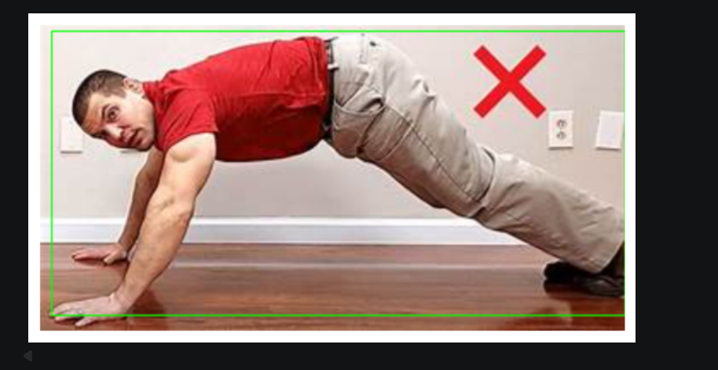
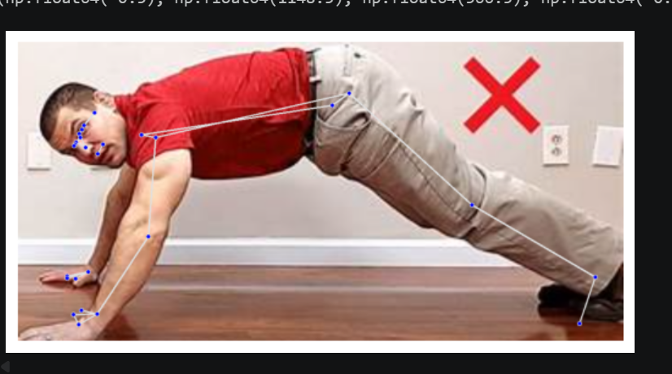
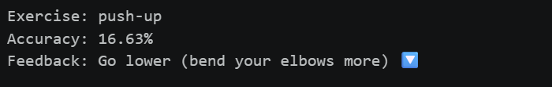

# Human Pose Correction System

A real-time human pose estimation and exercise correction system using MediaPipe and deep learning.

## Features
- Detects 33 body landmarks using MediaPipe Pose
- Computes joint angles for movement analysis
- Performs exercise classification using a trained deep learning model (.h5)
- Counts repetitions based on angle thresholds
- Provides basic posture correction feedback
- Real-time video processing using OpenCV

## Demo
Screenshots from project execution:

### Input Frame


### Pose Detection (MediaPipe Landmarks)


### Final Output (Exercise + Feedback)


## Tech Stack
- Python
- MediaPipe
- OpenCV
- NumPy
- TensorFlow / Keras

## How It Works
1. Video frames are captured using OpenCV  
2. MediaPipe extracts 33 body landmarks  
3. Joint angles are calculated using landmark coordinates  
4. Angles are used for:
   - Exercise classification (ML model)
   - Repetition counting (rule-based logic)  
5. Feedback is generated for incorrect posture  

## Project Structure

```text
pose-correction-system/
├── notebooks/
│   ├── Exercise_Classifier.ipynb
│   └── FinalProject.ipynb
├── model/
│   └── exercise_model.h5
├── assets/
│   ├── input.png
│   ├── pose_landmarks.png
│   └── output.png
├── main.py
├── requirements.txt
└── README.md ```


## Notes
- Full implementation available in notebooks  
- Project developed and tested on Google Colab  
- Model file: `exercise_model.h5`
